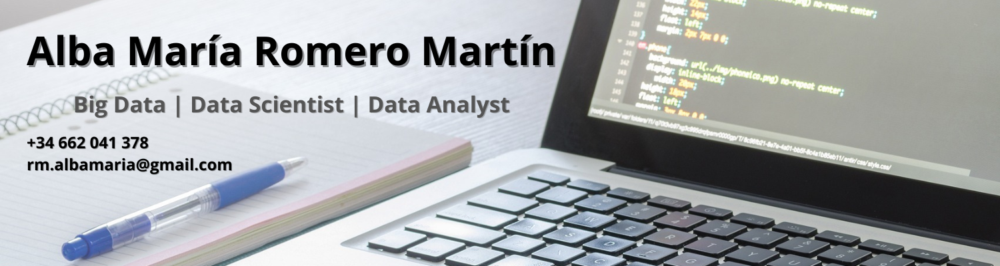

# 👩🏽‍💻 Sobre mí | About me

<table align = "center" style = "margin: 20px 20px; background-color: #2d2d2d; border-radius: 10px;">
  <tr>
    <td align = "center">

Me considero una persona polivalente, empática y con ganas de aprender. Estoy acostumbrada a trabajar tanto de 
manera individual como en equipo y tengo un gran empeño en hacer un trabajo impecable. Dispongo de experiencia 
en diversos campos, pero desarrollo un especial interés por las nuevas tecnologías.

Podrás obtener más información sobre mí en:

  

    </td>
    <td align = "center">

I consider myself a versatile person, empathetic and eager to learn. I am used to working both individually and in a team 
and I have a great determination to do an impeccable job. I have experience in various fields, but I develop a special 
interest in new technologies.

You can learn more about me at:

  

    </td>
  </tr>
</table>

# 🔧 Tecnologías | Technologies

  
   
  
  
  

